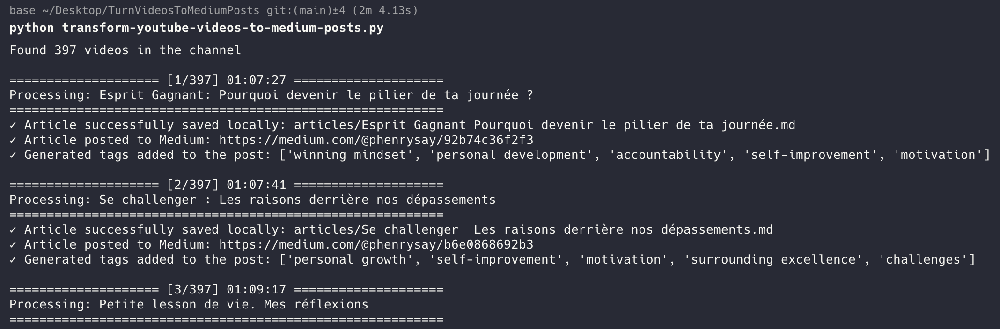

# YouTube to Medium Automation
## ⚡️ The Game-Changer Script You Will Always Be Grateful For!

**Automate the process of converting YouTube video content into Medium articles 🎥📝**

This program not only converts video transcripts extremely well into articles, but also removes any "transcript-like" writing. It produces a real, professional article from a video instead.

https://github.com/pH-7/youtube-to-medium-blog-posts-automation/blob/main/promo-assets/demo-turn-videos-to-medium-posts.mp4?raw=true

- [⚙️ Requirements](#%EF%B8%8F-requirements)
- [📦 Installation](#-installation)
- [🪄 Usage](#-usage)
- [🛠️ Configuration](#%EF%B8%8F-configuration)
- [👨‍🍳 Who is the creator?](#-who-created-this)
- [🤝 Contributing](#-contributing)
- [⚖️ License](#%EF%B8%8F-license)

## ⚙️ Requirements
 * [Python v3.7](https://www.python.org/downloads/) or higher 🐍
 * A Google account with YouTube API access 🎬
 * An OpenAI API key 🧠
 * A Medium account with an integration token ✍️

## 📦 Installation

1. Clone this repository:
   ```console
   git clone https://github.com/pH-7/youtube-to-medium-blog-posts-automation.git
   cd youtube-to-medium-blog-posts-automation
   ```

2. Install the required Python packages:
   ```console
   pip install -r requirements.txt
   ```

3. Set up your configuration file:
   - Create a file named `config.json` in the project root directory
   - Add your API keys and YouTube channel ID to the file as followed:
     ```json
     {
       "MEDIUM_ACCESS_TOKEN": "YOUR_MEDIUM_ACCESS_TOKEN",
       "MEDIUM_EN_PUBLICATION_ID": "OPTIONAL_ENGLISH_PUBLICATION_ID",
       "MEDIUM_FR_PUBLICATION_ID": "OPTIONAL_FRENCH_PUBLICATION_ID",
       "POST_TO_PUBLICATION": true,
       "YOUTUBE_API_KEY": "YOUR_YOUTUBE_API_KEY",
       "YOUTUBE_CHANNEL_ID": "YOUR_CHANNEL_ID",
       "OPENAI_API_KEY": "YOUR_OPENAI_API_KEY",
       "OPENAI_MODEL": "gpt-4o-mini",
       "UNSPLASH_ACCESS_KEY": "YOUR_UNSPLASH_KEY",
       "UNSPLASH_PREFERRED_PHOTOGRAPHER": "pierrehenry", // mention a preferred Unsplash photographer (e.g. pierrehenry)
       "PUBLISH_STATUS": "draft", // "draft" or "publish"
       "SOURCE_LANGUAGE": "en",
       "OUTPUT_LANGUAGE": "en"
     }
     ```

     Alternatively, you can refer to `example.config.json` in the project.

4. Set up YouTube API credentials:
   - Go to the [Google Developers Console](https://console.developers.google.com/)
   - Create a new project and enable the YouTube Data API v3
   - Create credentials (OAuth 2.0 Client ID) for a desktop application. Select **External** for **Use Type**
   - Download the client configuration and save it as `client_secrets.json` in the project root directory

5. Lastly, get your Unsplash API key: https://unsplash.com/oauth/applications/new

## 🪄 Usage

To run the script, use the following command in the project root directory:

```console
python transform-youtube-videos-to-medium-posts.py
```

**The script will:**
1. Fetch recent videos from your YouTube channel
2. Transcribe each video
3. Generate an exceptional well-written article for each video transcript
4. Create 5 most relevant tags for the article
5. Generate an engaging article title
6. Fetch relevant images from Unsplash for the article (one for article header, and 1-2 for content)
7. Embed a few images in the article content using Medium-compatible Markdown format.
8. Post the article to Medium as a draft
9. Save the generated article locally as a Markdown file, so you always keep a copy, with article's details in a markdown yaml-like metadata
10. Clearly mentioning any issues for each publishing step till the end, right in the terminal
11. Automatically wait a few minutes (for each iteration) before publishing a new article to Medium, to prevent being wrongly flagged as spam
12. Sit and relax. Enjoy the work!

**Note:** The script posts articles as drafts by default. To change this, modify the `PUBLISH_STATUS` to "publish" in the `config.json` file.

🙃 Enjoying this project? **[Offer me a coffee](https://ko-fi.com/phenry)** (**spoiler alert**: I love almond flat white 😋)



## 🛠️ Configuration

You can modify the following in the script:
- The number of videos to process (change `maxResults` in `get_channel_videos` function)
- The length of the generated article (change `max_tokens` in `generate_article` function)
- The number of tags to generate (modify the prompt in `generate_tags` function)

## 👨‍🍳 Who created this awesome script?

[](https://PH7.me 'Pierre-Henry Soria personal website')

**Pierre-Henry Soria**. A **super passionate engineer** who loves automating efficiently content creation! 🚀 Enthusiast for YouTube, AI, learning, and writing of course! 😊 Find me at [pH7.me](https://ph7.me) 💫

☕️ Enjoying this project? **[Offer me a coffee](https://ko-fi.com/phenry)** (spoiler alert: I love almond flat white 😋)

[![@phenrysay][twitter-icon]](https://x.com/phenrysay) [![pH-7][github-icon]](https://github.com/pH-7) [![YouTube Tech Videos][youtube-icon]](https://www.youtube.com/@pH7Programming "My YouTube Tech Channel")


## 🤝 Contributing

Contributions to this project are welcome! Please fork the repository and submit a pull request with your changes.

## ⚖️ License

**YouTube to Medium Automation** script is generously distributed under the *[MIT License](https://opensource.org/licenses/MIT)* 🎉 Enjoy!

## ⚠️ Disclaimer

This project is for educational purposes only. Ensure you comply with YouTube's terms of service and Medium's API usage guidelines when using this script.

<!-- GitHub's Markdown reference links -->
[twitter-icon]: https://img.shields.io/badge/x-000000?style=for-the-badge&logo=x
[github-icon]: https://img.shields.io/badge/GitHub-100000?style=for-the-badge&logo=github&logoColor=white
[youtube-icon]: https://img.shields.io/badge/YouTube-FF0000?style=for-the-badge&logo=youtube&logoColor=white
