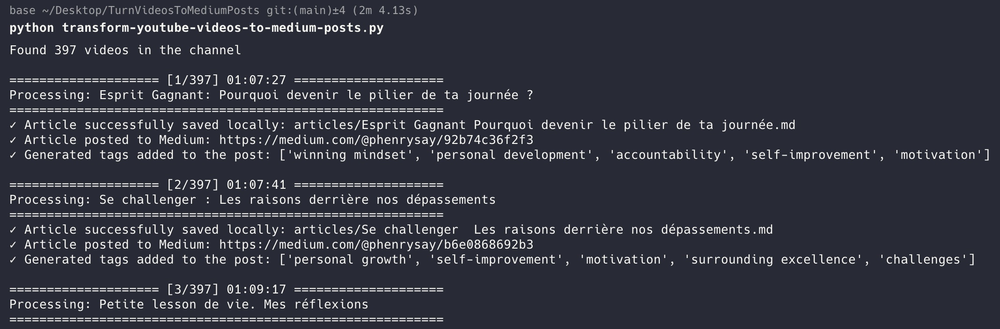

# 📝 YouTube to Medium Automation

## ⚡️ The Game-Changer Script You Will Always Be Grateful For!

**Automate the process of converting YouTube video content into Medium articles 🎥📝**

This program not only converts video transcripts extremely well into beautiful, SEO-optimized articles with images and captions, but also removes any "transcript-like" writing. It produces a real, professional article from a video instead.

- [⚙️ Requirements](#%EF%B8%8F-requirements)
- [📦 Installation](#-installation)
- [🪄 Usage](#-usage)
- [🛠️ Configuration](#%EF%B8%8F-configuration)
- [🎬 Demo](#-demo)
- [👨‍🍳 Who is the creator?](#-who-created-this)
- [🤝 Contributing](#-contributing)
- [⚠️ Disclaimer](#%EF%B8%8F-disclaimer)
- [⚖️ License](#%EF%B8%8F-license)


## ⚙️ Requirements
 * [Python v3.7](https://www.python.org/downloads/) or higher 🐍
 * A Google account with YouTube API access 🎬
 * An OpenAI API key 🧠
 * A Medium account with [an integration token](https://medium.com/me/settings/security) ✍️


## 📦 Installation

1. Clone this repository:
   ```console
   git clone https://github.com/pH-7/youtube-to-medium-blog-posts-automation.git &&
   cd youtube-to-medium-blog-posts-automation
   ```

2. Create and activate a virtual environment (recommended on macOS and other systems to avoid conflicts with system-managed Python installations; [PEP 668](https://peps.python.org/pep-0668/) prevents modifying these environments directly):
   ```console
   python3 -m venv .venv && source .venv/bin/activate
   ```

3. Install the required Python packages:
   ```console
   pip install -r requirements.txt
   ```

4. Set up your configuration file:
   - Create a file named `config.json` in the project root directory
   - Add your API keys and YouTube [Channel ID](https://www.youtube.com/account_advanced) to the file as followed:
     ```json
     {
       "PUBLISH_PLATFORMS": ["medium", "devto", "hashnode"], // Platforms to publish to. Use any subset, e.g. ["medium"]

       "MEDIUM_ACCESS_TOKEN": "YOUR_MEDIUM_ACCESS_TOKEN",
       "MEDIUM_EN_PUBLICATION_ID": "OPTIONAL_ENGLISH_PUBLICATION_ID",
       "MEDIUM_FR_PUBLICATION_ID": "OPTIONAL_FRENCH_PUBLICATION_ID",
       "MEDIUM_TECH_PUBLICATION_ID": "OPTIONAL_TECH_PUBLICATION_ID",
       "POST_TO_PUBLICATION": true, // Whenever we want the post to be published to a specified Medium's publication ID or not

       "DEVTO_API_KEY": "OPTIONAL_DEVTO_API_KEY", // Free key from https://dev.to/settings/extensions
       "DEVTO_ORGANIZATION_ID": null, // Optional Dev.to organization to publish under

       "HASHNODE_API_KEY": "OPTIONAL_HASHNODE_API_KEY", // Free token from https://hashnode.com/settings/developer
       "HASHNODE_PUBLICATION_ID": "OPTIONAL_HASHNODE_PUBLICATION_ID", // Required when publishing to Hashnode

       "OPENAI_API_KEY": "YOUR_OPENAI_API_KEY",
       "OPENAI_MODEL": "gpt-4.1", // non-reasoning models like "gpt-4.1", "gpt-4.1-mini"
       "UNSPLASH_ACCESS_KEY": "YOUR_UNSPLASH_KEY",
       "PUBLISH_STATUS": "draft", // "draft" or "publish"

       // Niche configurations
       "NICHES": {
         "self-help": {
           "YOUTUBE_CHANNEL_ID": "YOUR_SELF_HELP_CHANNEL_ID",
           "SOURCE_LANGUAGE": "fr",
           "OUTPUT_LANGUAGES": ["en", "fr"],
           "UNSPLASH_PREFERRED_PHOTOGRAPHER": "pierrehenry", // Optional. Mention a preferred Unsplash photographer (e.g. pierrehenry)
           "ARTICLES_BASE_DIR": "articles"
         },
         "tech": {
           "YOUTUBE_CHANNEL_ID": "YOUR_TECH_CHANNEL_ID",
           "SOURCE_LANGUAGE": "en",
           "OUTPUT_LANGUAGES": ["en"],
           "UNSPLASH_PREFERRED_PHOTOGRAPHER": null,
           "ARTICLES_BASE_DIR": "articles/tech"
         }
       },

       // Active niche to process ("self-help" or "tech" or "all")
       "ACTIVE_NICHE": "all"
     }
     ```

     **Multi-Platform Publishing:**
     - Set `PUBLISH_PLATFORMS` to any subset of `["medium", "devto", "hashnode"]`.
     - Each platform receives correctly formatted content automatically:
       - **Medium** → HTML (reliable kicker, subtitle and image captions)
       - **Dev.to** and **Hashnode** → Markdown (their native format)
     - A platform is only used when listed **and** its credentials are present; otherwise it is skipped with a clear message.
     - `PUBLISH_STATUS` (`"draft"` or `"publish"`) is honoured on every platform.
     - All successful URLs are recorded in the saved article's Markdown metadata.

     **Multi-Niche Support:**
     - The script now supports multiple content niches (self-help and tech)
     - Each niche has its own YouTube channel, languages, and custom prompts
     - Set `ACTIVE_NICHE` to `"all"`, `"self-help"`, or `"tech"` to control which niches to process
     - Tech niche is optimized for "NextGen Dev: AI & Code" technical content

     Alternatively, you can refer to `example.config.json` in the project.

5. Set up YouTube API credentials:
   - Go to the [Google Developers Console](https://console.developers.google.com/)
   - Create a new project and enable the **YouTube Data API v3**
   - Create credentials (OAuth 2.0 Client ID) for a desktop application. Select **External** for **Use Type**
   - Download the client configuration and save it as `client_secrets.json` in the project root directory

6. Lastly, get your Unsplash Access Key at https://unsplash.com/oauth/applications/new


## 🪄 Usage

To run the script, use the following command in the project root directory:

```console
python transform-youtube-videos-to-medium-posts.py
```

**Selecting which niche to process:**
- Edit `ACTIVE_NICHE` in `config.json`:
  - `"all"` - processes all configured niches
  - `"self-help"` - processes only self-help niche
  - `"tech"` - processes only tech niche

**The script will:**
1. Fetch recent videos from your YouTube channel(s)
2. Transcribe each video
3. Generate an exceptional well-written article for each video transcript
4. Create 5 most relevant tags for the article
5. Generate an engaging article title
6. Fetch relevant images from Unsplash for the article (one for article header, and 1-2 for content)
7. Embed a few images in the article content using Medium-compatible Markdown format.
8. Publish the article to every configured platform (Medium, Dev.to, Hashnode) with the correct format for each
9. Save the generated article locally as a Markdown file, so you always keep a copy, with article's details (incl. each platform URL) in a markdown yaml-like metadata
10. Clearly mentioning any issues for each publishing step till the end, right in the terminal
11. Automatically wait a few minutes (for each iteration) before publishing a new article to Medium, to prevent being wrongly flagged as spam
12. Sit and relax. Enjoy the work!

**Note:** The script posts articles as drafts by default. To change this, modify the `PUBLISH_STATUS` to "publish" in the `config.json` file.

🙃 Enjoying this project? **[Offer me a coffee](https://ko-fi.com/phenry)** (**spoiler alert**: I love almond flat white 😋)




## 🛠️ Configuration

You can modify the following in the script:
- The number of videos to process (change `maxResults` in ``get_videos_page` functio, which is declared in `get_channel_videos`)
- The length of the generated article (change `max_tokens` in `generate_article` function)
- The number of tags to generate (modify the prompt in `generate_tags` function)


## 🎬 Demo

See the script in action with these demonstration videos:

>  Articles conversion in French language

https://github.com/user-attachments/assets/0799a526-9d98-44e1-b875-7b5d510804c6

> Article conversion from English videos

https://github.com/user-attachments/assets/f951fd14-aec6-4c75-860c-c4297aba254d


## 🎥 I show you EVERYTHING 🤫

[](https://youtu.be/5JA2rq6TFwM)

[▶ Here to Watch on YouTube](https://youtu.be/5JA2rq6TFwM)


## 👨‍🍳 Who created this transformation script?

[](https://PH7.me 'Pierre-Henry Soria personal website')

**Pierre-Henry Soria**. A **super passionate engineer** who loves automating efficiently content creation! 🚀 Enthusiast for YouTube, AI, learning, and writing of course! 😊 Find me at [pH7.me](https://ph7.me) 💫

☕️ Enjoying this project? **[Offer me a coffee](https://ko-fi.com/phenry)** (spoiler alert: I love almond flat white 😋)

[![@phenrysay][x-icon]](https://x.com/phenrysay) [![YouTube Tech Videos][youtube-icon]](https://youtu.be/5JA2rq6TFwM "My YouTube Tech Channel") [![pH-7][github-icon]](https://github.com/pH-7) [![BlueSky][bsky-icon]](https://bsky.app/profile/pierrehenry.dev "Follow Me on BlueSky")


## ⚠️ Disclaimer

Please keep in mind that this **Videos to (Medium) Posts Converter** project is for educational purposes only. Ensure you always comply with YouTube's terms of service and Medium's API usage guidelines and policy when using this script.


## ⚖️ License

**YouTube to Medium Automation** script is generously distributed under the *[MIT License](https://opensource.org/licenses/MIT)* 🎉 Enjoy!


<!-- GitHub's Markdown reference links -->
[x-icon]: https://img.shields.io/badge/x-000000?style=for-the-badge&logo=x
[bsky-icon]: https://img.shields.io/badge/BlueSky-00A8E8?style=for-the-badge&logo=bluesky&logoColor=white
[github-icon]: https://img.shields.io/badge/GitHub-100000?style=for-the-badge&logo=github&logoColor=white
[youtube-icon]: https://img.shields.io/badge/YouTube-FF0000?style=for-the-badge&logo=youtube&logoColor=white
